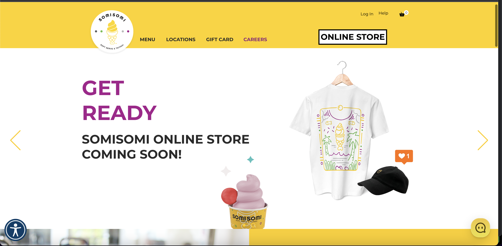
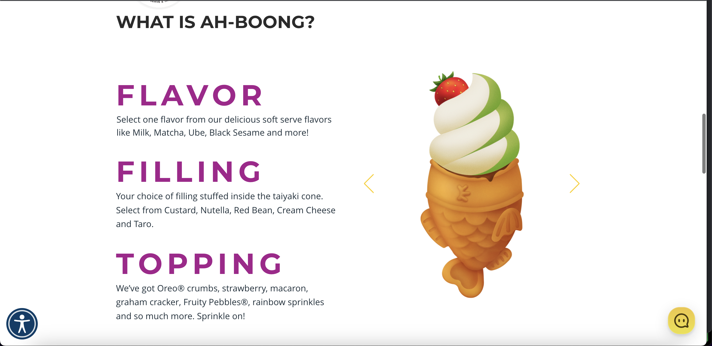
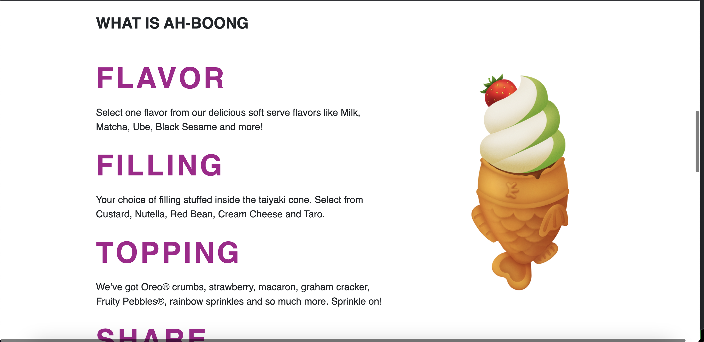

## Introduction

User Interface (UI) Frameworks are not simple. They can complex to learn, almost like a new programming languague. Some might ask, why bother using UI frameworks, like Bootstrap 5? What are the benefits to using them? Why not stick to raw HTML and CSS? Through my short esasy, I will cover over the advantges of UI frameworks and my opinion on them. 

## Reflection

UI frameworks offer a structured set of tools, components and designs to assist the creation of responsive and visually appealing websites. By utilizing pre-deisgned elements like navigations bars, buttons, etc. developers can complete projects faster and more efficently. Using UI frameworks allows developers to easily add responsiveness to their projects. This boost overall user experience, making it more likely for a user to come back. Additionaly, Bootstrap 5 helps developers create websites that can easily adapt to various screen sizes and devices. This is important, especially in this era of technology where everyone is online. As for HTML and CSS, it is viable for simple projects or projects that require custom and unqiue designs. But, static websites are outdated and the interactivity from UI frameworks boost user experience while on a website. 

## My Opinion

In my opinion, I find using bootstrap very helpful and efficent, but it's also very confusing. There are so many different classes and functionality with UI frameworks that it's hard to know what to use in different situations. Through my time of recreating a website, I found myself getting stuck trying to place an image or text in the right position, it took me a while to finish the reacraetion, but I think if I recreated the website without bootstrap, it would've took even longer. Additionally, I think bootstrap allows for clearer and more readable code. Despite their initial complexity, I think it's very beneficially to learn in terms of efficency and responsiveness. 

### Real Website

### Recreation (using bootstrap)

