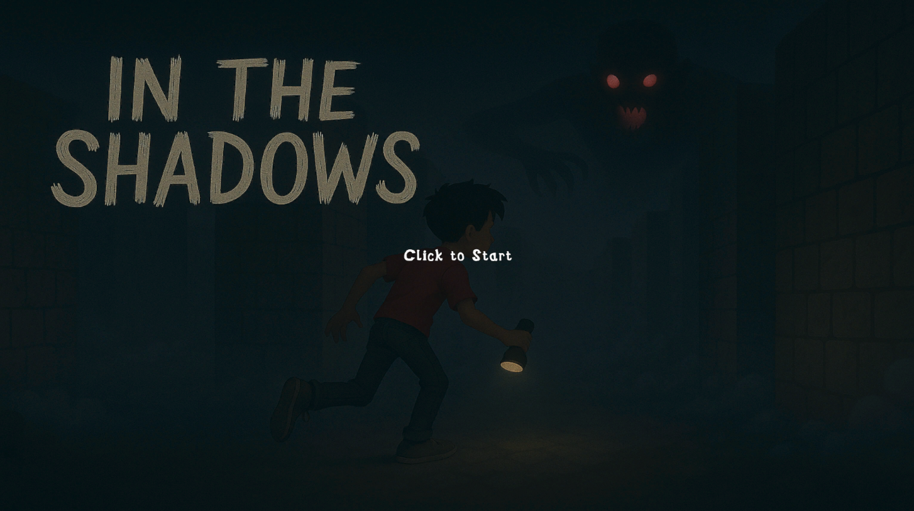
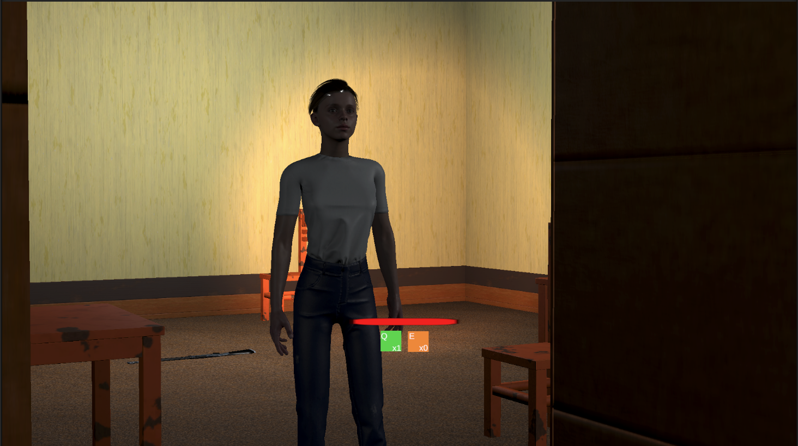
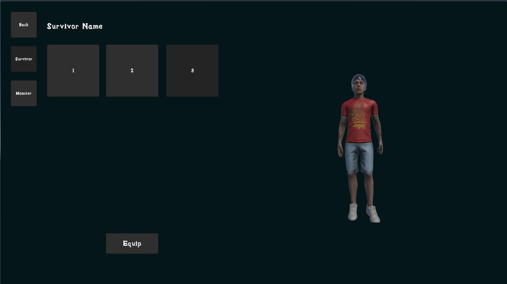
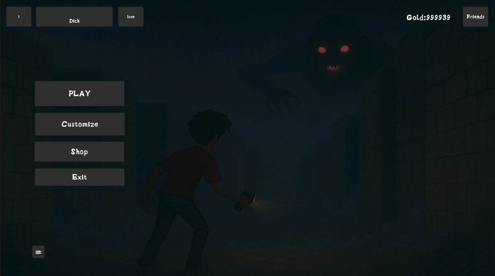
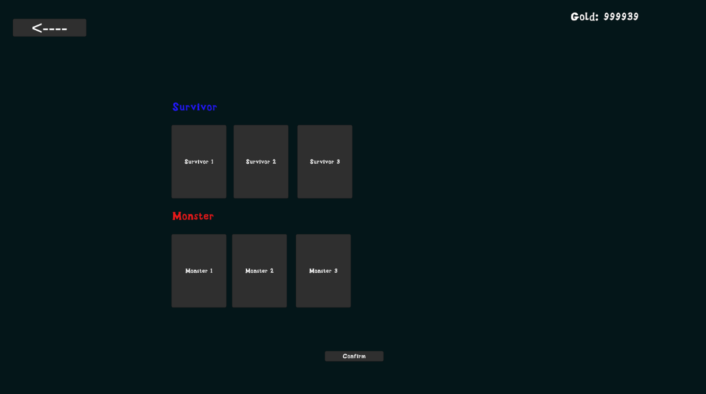

  
  <h3 class="mt-3">A thrilling race to the center — with a monster by your side.</h3>

<nav class="minimal-toc" aria-label="On this page">
  <a href="#game-pitch">Game Pitch</a>
  <a href="#game-trailer">Trailer</a>
  <a href="#game-design--art">Design</a>
  <a href="#whats-next">Roadmap</a>
</nav>

## Game Pitch

***In The Shadows*** is a fast-paced multiplayer horror puzzle game where players must escape a dark maze while being relentlessly hunted by AI-controlled monsters. Each match pits up to four players against a terrifying AI that won't stop until you're eliminated.

Players choose both a character and a monster partner, each with their own future special abilities, and spawn on the edge of a procedurally generated maze. The goal is to navigate the maze, avoid being hunted, and find the hidden door in the center to escape.

Use strategy and tools like shotguns to distract or slow the monster, but be warned: getting caught a few times means you're out. Fast-paced matches lasting 5–10 minutes make this ideal for speedrunners, horror fans, and competitive players alike. Earn gold, unlock new characters and monsters, and prepare for ranked play and additional upgrades in future updates.

**Will you find the door, or will the shadows find you?**

## Game Trailer

  

    <iframe class="embed-responsive-item shadow" src="https://www.youtube.com/embed/r3j6km0amA4" title="In the Shadows gameplay trailer" allowfullscreen></iframe>
  

  
<em>See the gameplay in action.</em>

## Game Design & Art

Preview some of our UI and concept work:

  

    
    
<em>Gameplay</em>

  

  

    
    
<em>Start menu</em>

  

  

    
    
<em>Character selection</em>

  

  

    
    
<em>Main menu</em>

  

  

    
    
<em>Shop</em>

  

## What's Next

Our team is focused on these key improvements for the full release:

  <article class="roadmap-item">
    

      <h4>Expanded Online Features</h4>
      
Refined matchmaking, lobby chat, and smoother gameplay synchronization.

    

  </article>
  <article class="roadmap-item">
    

      <h4>New Monsters & Survivors</h4>
      
Unique character abilities that enhance strategic depth and replayability.

    

  </article>
  <article class="roadmap-item">
    

      <h4>Polish & Optimization</h4>
      
Animation fixes and improved player controls for smoother gameplay.

    

  </article>
  <article class="roadmap-item">
    

      <h4>Accessibility Options</h4>
      
Customizable controls, display settings, and audio preferences.

    

  </article>
  <article class="roadmap-item">
    

      <h4>Environmental Hazards</h4>
      
New maps with fog, traps, and darkness mechanics for unpredictable gameplay.

    

  </article>
  <article class="roadmap-item">
    

      <h4>Story Campaign</h4>
      
Mission-based adventures with cutscenes and unlockable lore elements.

    

  </article>

