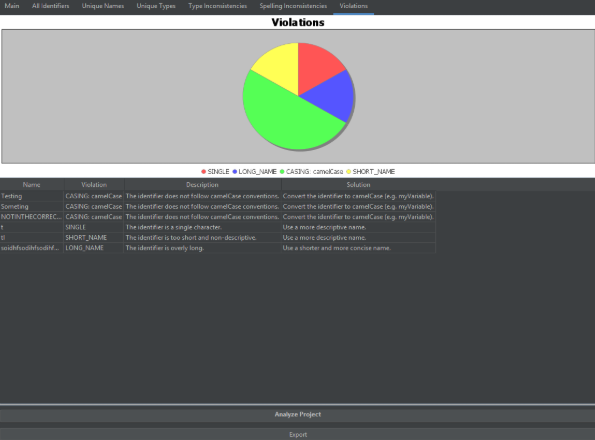
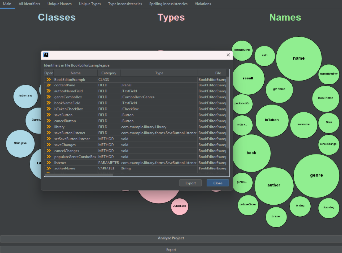
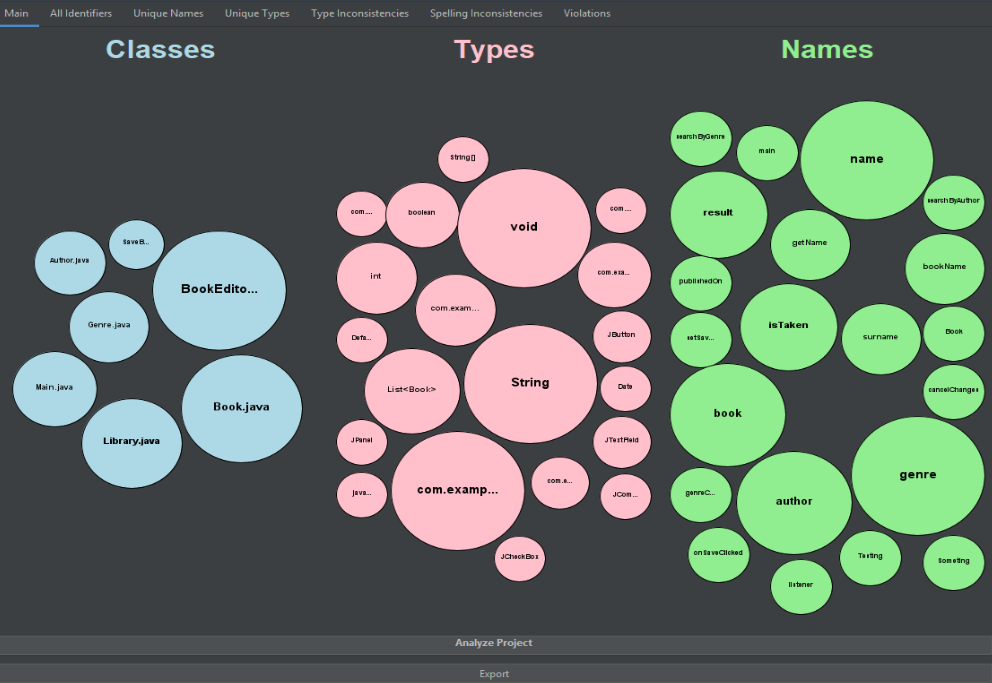

  
  <h3 class="mt-3">Improving code quality through identifier analysis</h3>

<nav class="minimal-nav">
  <a href="#overview">Overview</a>
  <a href="#features">Features</a>
  <a href="#methodology">Methodology</a>
  <a href="#challenges">Challenges</a>
  <a href="#tools">Tools</a>
  <a href="#team">Team</a>
</nav>

## Overview

The Identifier Name IDE Plugin enhances code quality by analyzing how developers name variables, methods, and classes within their software projects. Identifiers contribute approximately 70% of source code and serve as critical documentation that conveys developer intent. The plugin provides visualization tools for identifier naming patterns, detects naming violations, and suggests improvements, enabling developers to maintain consistent coding standards and improve code readability.

## Features

  

    

      <i class="fas fa-chart-bubble text-accent"></i>
    

    <h4>Bubble Chart Visualization</h4>
    
Displays an interactive bubble chart that highlights identifier naming patterns, organized by categories of identifiers. Each bubble corresponds to a specific set of identifiers, with tooltips that provide more details about the set.

  

  
  

    

      <i class="fas fa-exclamation-triangle text-accent"></i>
    

    <h4>Violations Detection</h4>
    
Creates an identifier report that highlights identifier naming violations detected across the project along with a rating of violations on a scale of severity. Users can view which identifiers have violations and suggestions on how to resolve them.

  

  
  

    

      <i class="fas fa-file-export text-accent"></i>
    

    <h4>Data Export</h4>
    
Developed an export system that allows users to download identifier data in CSV or JSON formats. This helps support easy sharing, analysis, and documentation of identifier usage and violations.

  

  
  

    

      <i class="fas fa-code text-accent"></i>
    

    <h4>Format Identifiers</h4>
    
Built a featured system that extracts all identifiers from a project, grouped by their format type (parameters, fields, variables, classes, types).

  

## Implementation

  

    

      
      
<em>Data Export Interface</em>

    

  

  

    

      
      
<em>Violations Detection Panel</em>

    

  

  

    

      
      
<em>Bubble Chart Visualization</em>

    

  

## Methodology

  

    1
    
Identifiers are Organized into distinct categories

  

  

    2
    
Identifiers are Diagrammed into lists by relationship (Parameter, Field, Variable)

  

  

    3
    
Identifiers are Diagrammed into lists by category (Class, Type and Name)

  

  

    4
    
Violations are presented with a severity scale

  

  

    5
    
Violations are gathered with a zero-to-full that shows the violations

  

  

    6
    
Identifiers are evaluated by Type, Class and Name

  

## Challenges

There were a variety of challenges that were encountered throughout the development of the plugin, particularly with implementing the tool across different coding styles and understanding the framework. Additionally, managing overlapping elements in bubble visualizations and handling the UI responsive involved complex design and event handling aspects. The project also introduced additional layers of testing and debugging.

## Next Steps

The Identifier Name IDE Plugin brings identifier analysis and visualization into the development workflow, aiding in code comprehension and refactoring. Future development will focus on integration with more language-specific conventions, multi-language support for different syntaxes, and more customizations on style preferences to better adapt to the needs of the user.

## Team

  
<strong>Aaren Orquia, Samuel Yang, Josiah Liu</strong>

  
Sponsor: Anthony Peruma

  
ICS 414 Software Project – Spring 2023

## Tools & Frameworks

  

    
    IntelliJ
  

  

    
    Kotlin
  

  

    
    Java
  

  

    
    Gradle
  

  

    
    GitHub
  

