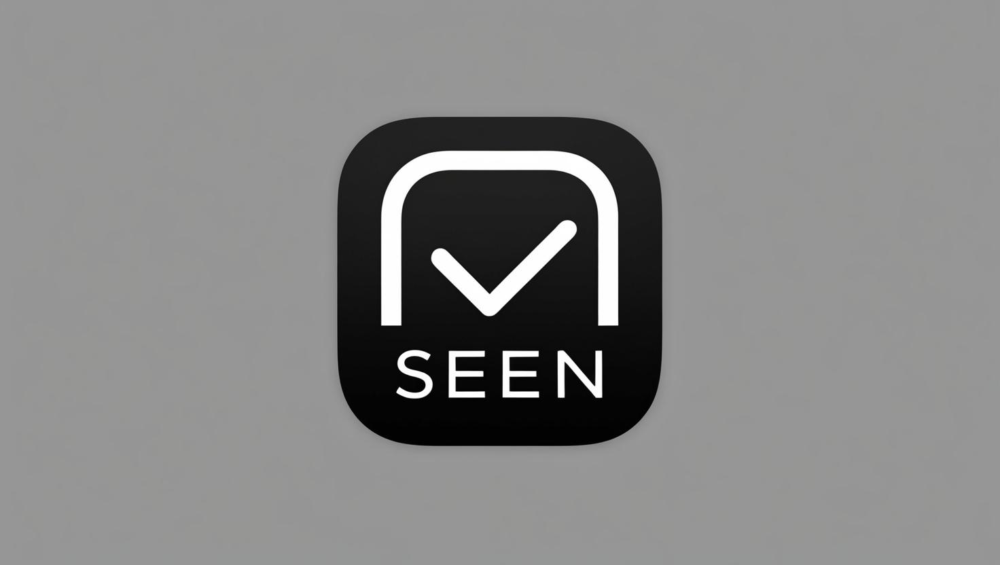
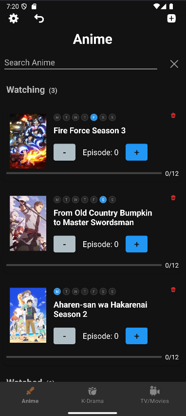
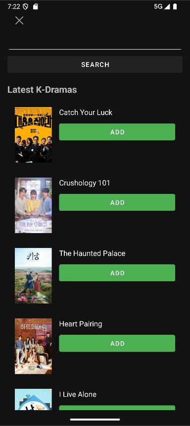
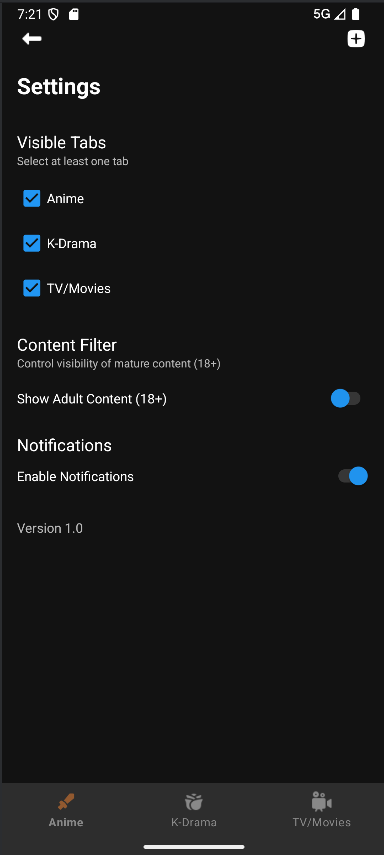

  
  <h3 class="mt-3">Track your shows, one episode at a time.</h3>

  <a href="#overview" class="mx-3">Overview</a>
  <a href="#features" class="mx-3">Features</a>
  <a href="#screenshots" class="mx-3">Screenshots</a>
  <a href="#technology" class="mx-3">Technology</a>
  <a href="#development" class="mx-3">Development</a>

## Overview {#overview}

**Seen** is a minimalist watchlist app designed to help users effortlessly track their favorite anime, K-dramas, and TV shows. With an intuitive interface and comprehensive tracking features, Seen makes it easy to manage what you're currently watching, what you've finished, and what you plan to watch next.

The app provides a centralized platform for maintaining your media consumption across different genres and platforms, giving you clear progress indicators and organized lists to ensure you never lose track of your shows again.

## Features {#features}

  

    

      <i class="fas fa-tasks text-accent"></i>
    

    <h4>Progress Tracking</h4>
    
Visual progress bars show exactly how far you are in each series.

  

  
  

    

      <i class="fas fa-list text-accent"></i>
    

    <h4>Multiple Lists</h4>
    
Organize content into "Watching" and "Watched" categories.

  

  
  

    

      <i class="fas fa-search text-accent"></i>
    

    <h4>Advanced Search</h4>
    
Find shows quickly with external API integration.

  

  
  

    

      <i class="fas fa-sliders-h text-accent"></i>
    

    <h4>Customizable UI</h4>
    
Enable or disable tabs based on your preferences.

  

  
  

    

      <i class="fas fa-shield-alt text-accent"></i>
    

    <h4>Content Filtering</h4>
    
Age-appropriate content controls for your comfort.

  

  
  

    

      <i class="fas fa-feather text-accent"></i>
    

    <h4>Minimal Design</h4>
    
Clean, distraction-free interface for better focus.

  

## Screenshots {#screenshots}

  

    <!-- Indicators -->
    <ol class="carousel-indicators">
      <li data-target="#animeCarousel" data-slide-to="0" class="active"></li>
      <li data-target="#animeCarousel" data-slide-to="1"></li>
      <li data-target="#animeCarousel" data-slide-to="2"></li>
      <li data-target="#animeCarousel" data-slide-to="3"></li>
    </ol>

    <!-- Slides -->
    

      

        

          

            
          

          

            <h5>Watching List</h5>
            
Keep track of shows you're currently watching

          

        

      

      
      

        

          

            
          

          

            <h5>Popular Anime</h5>
            
Discover trending shows in the anime community

          

        

      

      
      

        

          

            
          

          

            <h5>K-Drama Collection</h5>
            
Browse your favorite Korean dramas

          

        

      

      
      

        

          

            
          

          

            <h5>Settings Screen</h5>
            
Customize your Content

          

        

      

    

    <!-- Controls -->
    <a class="carousel-control-prev" href="#animeCarousel" role="button" data-slide="prev">
      
      Previous
    </a>
    <a class="carousel-control-next" href="#animeCarousel" role="button" data-slide="next">
      
      Next
    </a>
  

  
  

    
<em>Click through to explore different categories in your collection</em>

  

## Technology {#technology}

  

    <i class="fab fa-java fa-2x mb-2 text-accent"></i>
    
Java

  

  

    <i class="fas fa-database fa-2x mb-2 text-accent"></i>
    
SQLite

  

  

    <i class="fas fa-code fa-2x mb-2 text-accent"></i>
    
XML

  

  

    <i class="fab fa-android fa-2x mb-2 text-accent"></i>
    
Android SDK

  

## Development {#development}

Seen was developed with a focus on simplicity and efficiency. Key development principles included:

- **Clean architecture** separating UI, business logic, and data storage
- **Room database** implementation for robust data persistence
- **Repository pattern** abstracting data sources and providing a clean API for the application
- **API integration** with popular services like TVMaze, OmDB and MyAnimeList for comprehensive show information
- **Adaptive UI** that works well on different screen sizes and device orientations

### Future Roadmap

The app continues to evolve with planned features including:

- User accounts and cloud synchronization for multi-device usage
- Social features for sharing and recommending shows to friends
- Enhanced analytics showing viewing habits and preferences
- Integration with streaming services to launch shows directly

The app was created as a personal project to solve my own challenge of keeping track of multiple shows across different streaming platforms. It evolved into a comprehensive solution that others with similar needs could benefit from as well.

