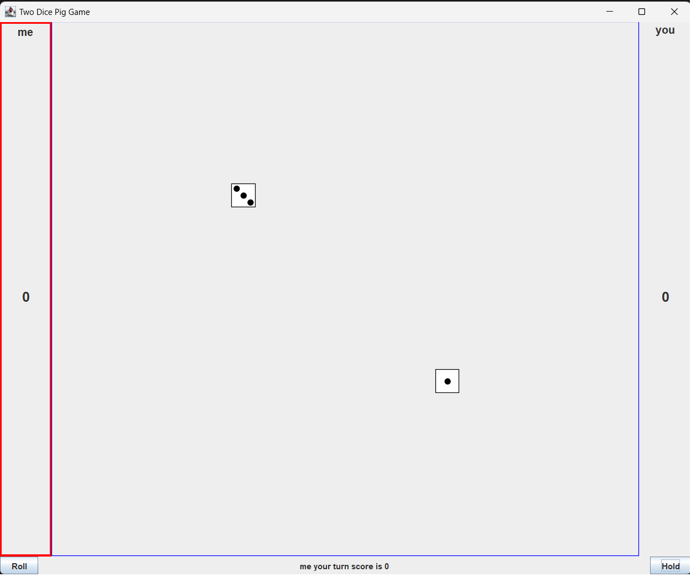

This project is a simple dice game called Two Dice Pig. This game is played by 2 people using a pair of dice. I wrote this program in my 1st year, in ICS111. This project includes a graphical interface. I like this project because it's really fun and it's what got me hooked to coding and programming. From this project, I learned how to use else-if statements and learned about using functions in javas library. 

## How to play

Roll dice until the score is reached
Rolling two different numbers adds the numbers to your turn score, you can either roll again or hold
Rolling double 1's resets your whole score
Rolling one 1 sets your turn score to 0
Rolling doubles forces you to roll again

# 

## How it works

Using math.random, I was able to get the dice roll. By using if-else statements, I was able to set the rules of the game. Since this was a beginning level computer science course, the graphical interface was given to us from our instructor. 

This is what the game looks like: 

